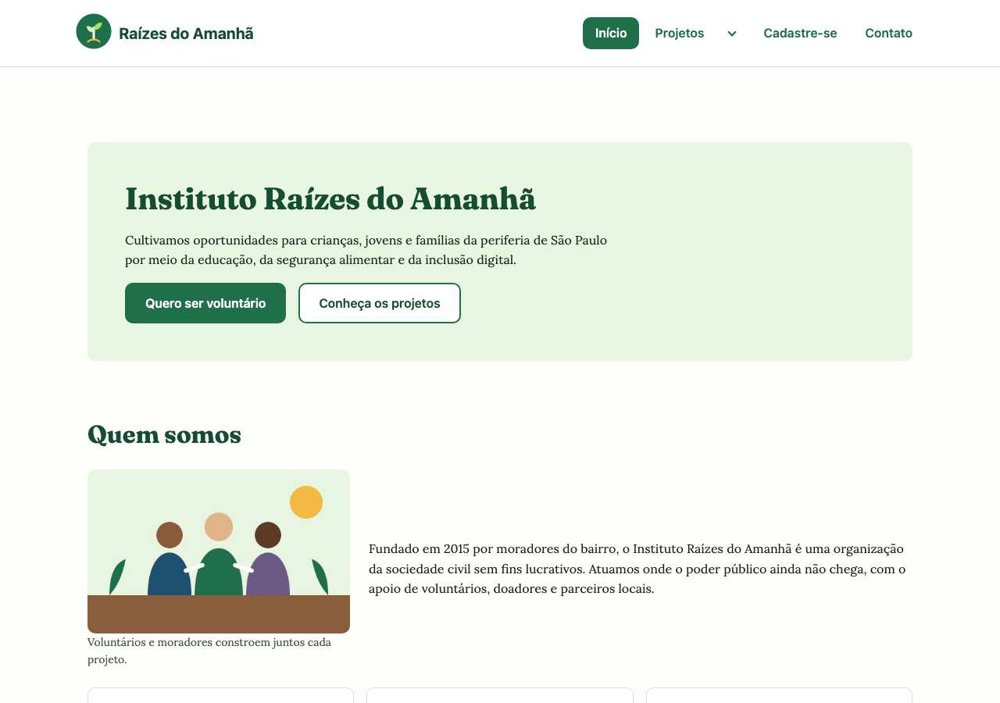
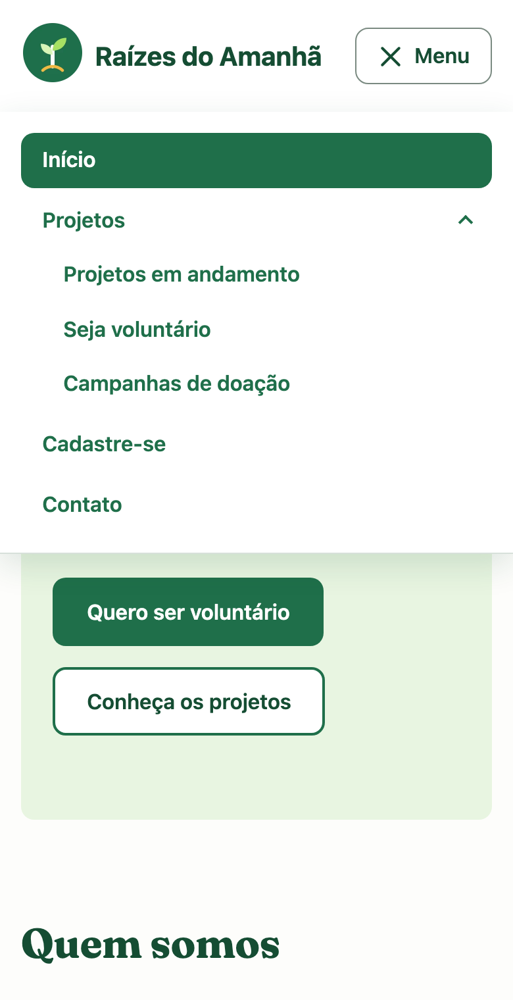
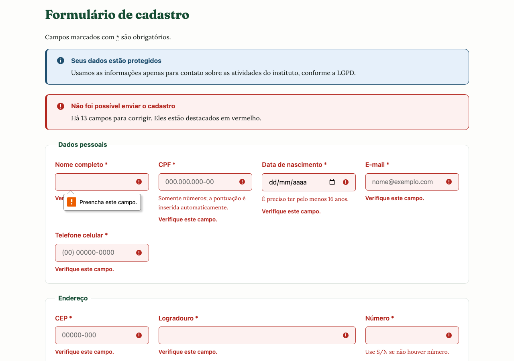
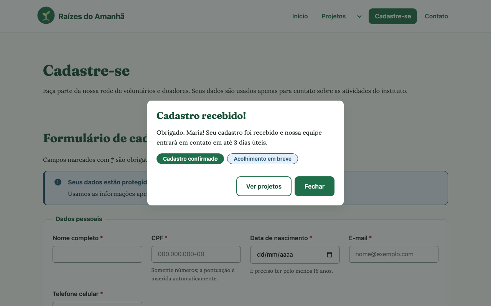
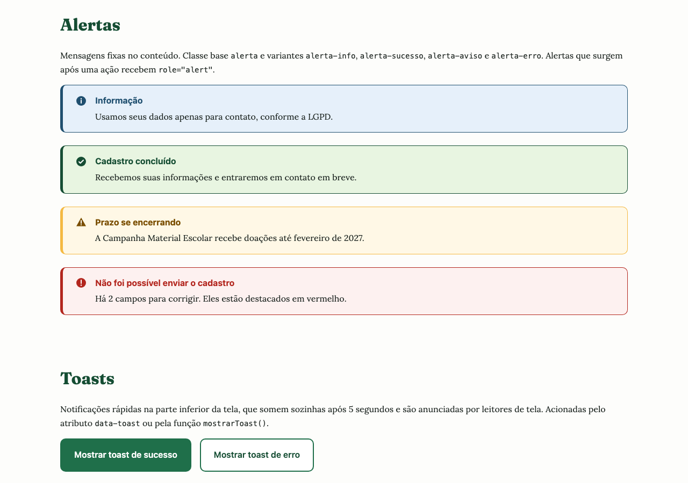
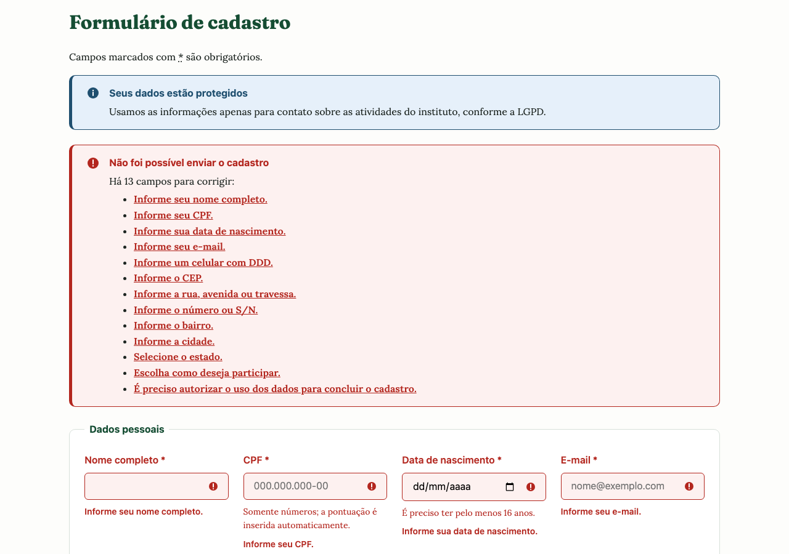
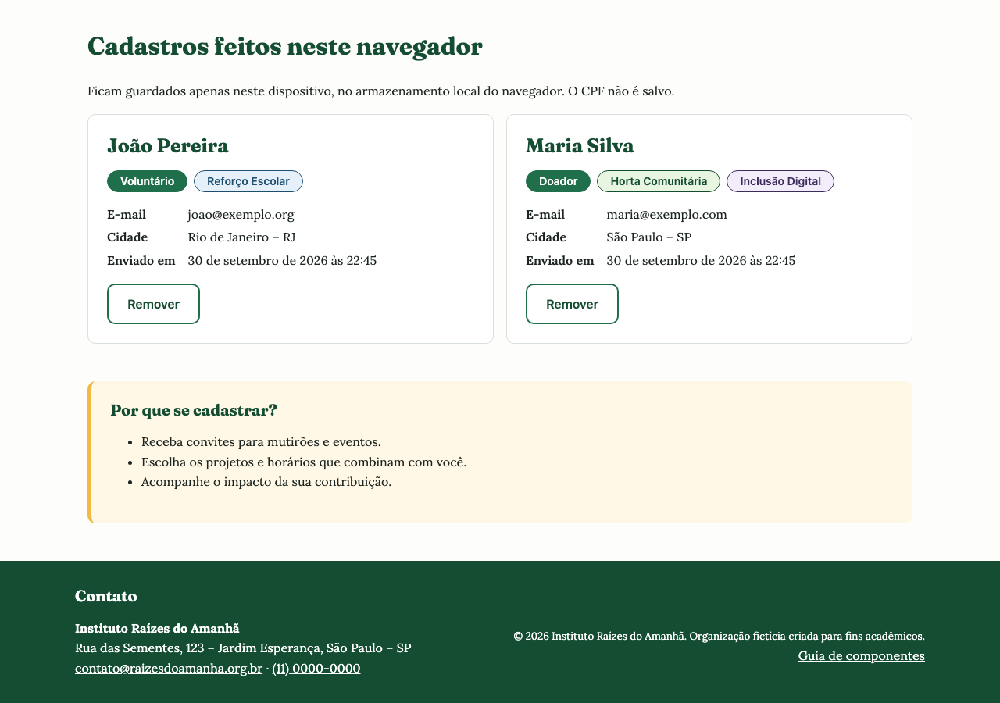
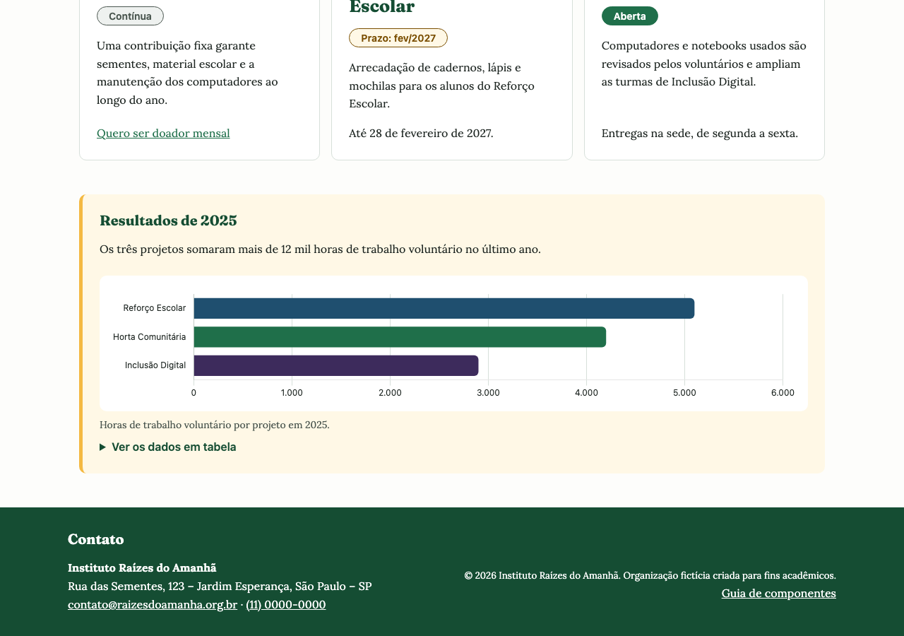
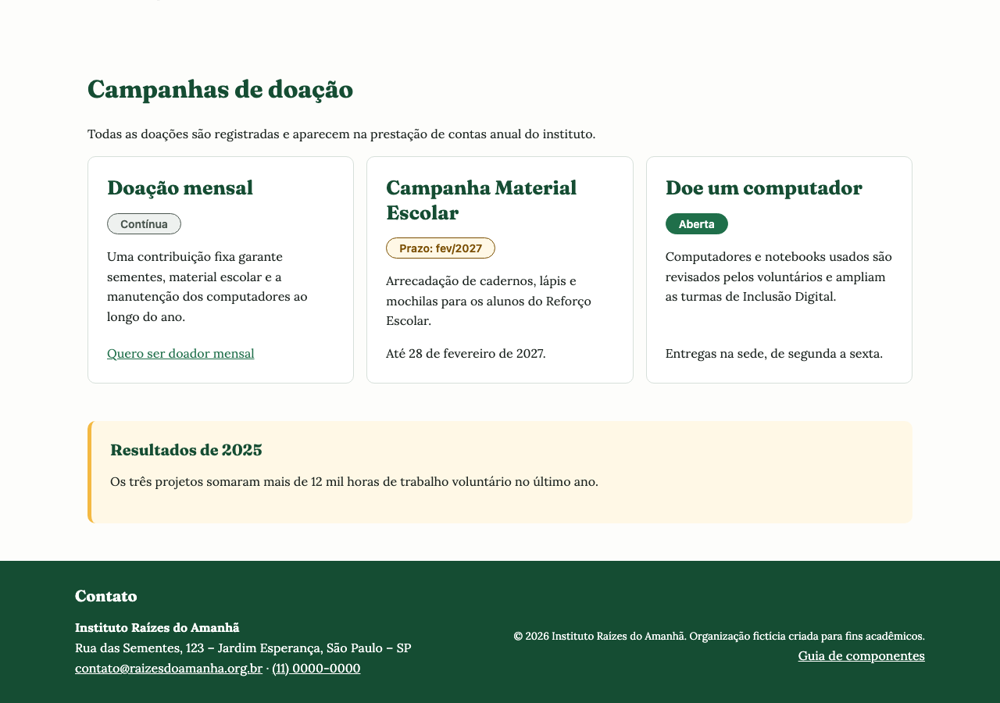

# Instituto Raízes do Amanhã — Plataforma Web para ONG

Plataforma web para uma organização do terceiro setor, construída com **HTML5 semântico**, **CSS3** e **JavaScript vanilla**. O projeto evolui em etapas: primeiro a estrutura acessível e o formulário com validação, depois um design system completo com layout responsivo e componentes de feedback e, por fim, uma **Single Page Application** em JavaScript modular, com templates, persistência no navegador e gráficos.

**🔗 Site publicado:** https://matheuscssouza.github.io/ong-plataforma-frontend/



---

**Sumário:** [Contexto](#contexto) · [Páginas](#páginas) · [Destaques técnicos](#destaques-técnicos) · [Tecnologias](#tecnologias) · [Estrutura de pastas](#estrutura-de-pastas) · [Pré-requisitos](#pré-requisitos) · [Instalação e execução](#instalação-e-execução) · [Testes](#testes) · [Build e deploy](#build-e-deploy) · [Manutenção](#manutenção) · [Etapas do desenvolvimento](#etapas-do-desenvolvimento)

## Contexto

Projeto desenvolvido na disciplina **Desenvolvimento Front-end** do curso de Engenharia de Software da Universidade Cruzeiro do Sul, ao longo de três Experiências Práticas.

O terceiro setor brasileiro reúne mais de 820 mil organizações da sociedade civil, mas só uma parte delas tem presença digital adequada. Para ONGs, que dependem de voluntários e doações, um site claro e acessível é o que transforma um visitante em apoiador. O desafio foi projetar essa plataforma com semântica correta (essencial para SEO e leitores de tela), uma interface consistente e um cadastro que garanta a integridade dos dados coletados.

> O **Instituto Raízes do Amanhã** é uma organização fictícia, criada para fins acadêmicos. Endereço e contatos exibidos no site são ilustrativos.

## Páginas

| Página | Conteúdo |
|---|---|
| [`index.html`](index.html) | Apresentação da ONG: missão, visão e valores, números de impacto, formas de ajudar e contato |
| [`projetos.html`](html/projetos.html) | Projetos sociais e campanhas gerados por templates, voluntariado e gráfico de horas de voluntariado |
| [`cadastro.html`](html/cadastro.html) | Cadastro com validação por campo, máscaras, rascunho automático e lista de cadastros salvos no navegador |
| [`componentes.html`](html/componentes.html) | Guia de componentes: badges, alertas, toasts, modal e botões, com as classes para reutilização |

## Destaques técnicos

### Experiência Prática I — Estrutura semântica e formulários

**Semântica e acessibilidade**
- Estrutura com `header`, `nav`, `main`, `section`, `article`, `aside`, `footer` e `address`.
- Um único `<h1>` por página e hierarquia de títulos sem saltos de nível.
- Seções nomeadas com `aria-labelledby`, página atual indicada no menu com `aria-current` e link "Pular para o conteúdo".
- Texto alternativo descritivo nas imagens informativas e `alt=""` na logo decorativa.

**Formulário de cadastro**
- Campos agrupados em `fieldset` + `legend`, com tipos adequados a cada dado (`email`, `date`, `tel`, `number`, `radio`, `checkbox`).
- Validação nativa: `required`, `pattern`, `minlength`/`maxlength`, `min`/`max`/`step`.
- Máscaras em JavaScript para **CPF**, **telefone** e **CEP**, e conferência dos dígitos verificadores do CPF com `setCustomValidity`.

**Imagens**
- Ilustrações próprias em **WebP** e **PNG**, servidas com `<picture>`, em 2x e com `width`/`height` definidos.

### Experiência Prática II — Estilização e layouts

**Design system** (variáveis no `:root` de [`css/style.css`](css/style.css))
- Paleta com cores primárias, secundárias, neutras, de feedback e de categoria, todas com contraste verificado pela WCAG (texto principal com 15,4:1).
- Escala tipográfica modular de razão 1,25 (14px a 39px) e espaçamentos em escala de 8px.
- Nenhuma cor ou espaçamento solto no código: tudo vem das variáveis.

**Layout responsivo**
- Grid de **12 colunas** aplicado ao conteúdo e aos blocos internos, com **cinco breakpoints mobile first**: 576, 768, 992, 1200 e 1440px.
- **Flexbox** nos componentes internos: cartões com a última linha alinhada à base, menu, grupos de botões e campos.

**Navegação interativa**
- Menu **hambúrguer** no celular e **dropdown** de Projetos no desktop, controlados por `aria-expanded`.
- Fecha com Esc e com clique fora; sem JavaScript o menu continua visível; animações respeitam `prefers-reduced-motion`.



**Estados e feedback**
- Botões com `:hover`, `:focus-visible`, `:active` e `:disabled`.
- Campos com sinalização de sucesso e erro (`:user-valid` / `:user-invalid`), com ícone e mensagem em texto, não só cor.
- Componentes de feedback reutilizáveis: **badges**, **alertas** (info, sucesso, aviso e erro), **toasts** e **modal** com o `<dialog>` nativo.
- O envio do cadastro mostra o botão desabilitado ("Enviando…"), um alerta com a contagem de campos a corrigir e um modal de confirmação.





**Guia de componentes**
- A página [`componentes.html`](html/componentes.html) documenta cada componente com suas classes. Modal e toasts podem ser acionados só com atributos (`data-abrir-modal`, `data-toast`), permitindo que o back-end gere o HTML sem escrever JavaScript.



### Experiência Prática III — JavaScript e interatividade

**Single Page Application** ([`js/roteador.js`](js/roteador.js))
- Roteamento por hash (`#/projetos`, `#/cadastro`), compatível com o GitHub Pages sem configuração de servidor.
- O `index.html` é a casca: só o `<main>` é trocado, com atualização do título, do menu ativo e do foco (anunciado por leitores de tela).
- Voltar/Avançar, entrada direta por link, rota inexistente, aviso sem conexão e proteção contra carregamentos fora de ordem.
- Aprimoramento progressivo: os links apontam para os arquivos reais, que também funcionam sozinhos.

**Templates dinâmicos** ([`js/componentes/templates.js`](js/componentes/templates.js))
- Projetos, campanhas e cadastros salvos são gerados a partir de dados, clonando elementos `<template>` do HTML5.
- Os dados entram sempre por `textContent`, nunca por `innerHTML`: conteúdo digitado ou adulterado não executa código.

**Formulário e dados**
- Verificação de consistência com mensagens específicas por campo, revalidação em tempo real e resumo com links no envio ([`js/formulario/validacao.js`](js/formulario/validacao.js)).
- Regras além do HTML: nome e sobrenome, dígitos do CPF, domínio do e-mail, celular com 9 e valor obrigatório para doadores.
- **localStorage**: rascunho salvo automaticamente e restaurado ao reabrir, e histórico de cadastros com opção de remover. Por privacidade, o **CPF nunca é gravado**.





**Biblioteca externa**
- **Chart.js** 4.5.1 via CDN, carregado só quando a página tem um gráfico, com versão fixa e verificação de integridade (SRI).
- Os dados vêm de uma tabela acessível, que aparece no lugar do gráfico se o CDN falhar.



**Código modular**
- JavaScript em **ES Modules** (`import`/`export`), organizado por responsabilidade: `componentes/`, `formulario/`, `servicos/` e `dados/`.
- Cada página carrega um único `js/main.js`; nenhum módulo executa nada ao ser importado.

**Testes**
- Roteiros automatizados no navegador cobriram navegação, validação, armazenamento, gráfico e cenários de estresse (dados malformados, conexão caindo, cliques rápidos, armazenamento cheio).
- A rodada de estresse encontrou e corrigiu seis falhas, entre elas uma condição de corrida no roteador e o envio duplicado do formulário.

### Qualidade
- **W3C Markup Validator:** 0 erros e 0 avisos nas quatro páginas.
- **W3C CSS Validator:** 0 erros.
- Testes visuais em larguras de 375px a 1500px, sem rolagem horizontal.



## Tecnologias

- **HTML5** semântico
- **CSS3**: variáveis, Grid, Flexbox, media queries, pseudo-classes de validação e animações
- **JavaScript** (vanilla, ES Modules), **localStorage** e **Chart.js** (gráficos)
- Fontes **Fraunces** e **Lora** (Google Fonts)
- **Git** (GitFlow, Conventional Commits, versionamento semântico) e **GitHub Pages**
- **Node.js** + **Chrome DevTools Protocol** para os testes automatizados

## Estrutura de pastas

```
ong-plataforma-frontend/
├── index.html              # Casca da SPA e página inicial
├── html/                   # Demais páginas (também funcionam sozinhas)
│   ├── projetos.html
│   ├── cadastro.html
│   └── componentes.html
├── css/
│   └── style.css           # Design system, layout e componentes
├── js/                     # ES Modules (import/export)
│   ├── main.js             # Ponto de entrada: liga os módulos
│   ├── roteador.js         # Navegação SPA por hash
│   ├── componentes/        # menu, feedback (toast/modal), templates, gráfico
│   ├── formulario/         # máscaras, validação e cadastro
│   ├── servicos/           # localStorage e carregamento do Chart.js
│   └── dados/              # conteúdo de projetos e campanhas
├── imagens/                # Imagens em PNG e WebP (logo também em SVG)
├── tests/                  # Testes de ponta a ponta (npm test)
├── docs/                   # Respostas de cada etapa e capturas de tela
├── package.json            # Scripts npm start e npm test
└── CONTRIBUTING.md         # GitFlow, padrão de commits e checklist de revisão
```

## Pré-requisitos

| Ferramenta | Para quê | Versão |
|---|---|---|
| Navegador moderno (Chrome, Edge, Firefox ou Safari) | Usar o site | Com suporte a ES Modules e `<dialog>` |
| Git | Clonar o repositório | Qualquer versão recente |
| Python 3 **ou** Node.js | Servidor local para desenvolvimento | Python 3.8+ ou Node 22+ |
| Node.js + Google Chrome | Executar os testes automatizados | Node 22+ |

O projeto **não tem dependências de terceiros para instalar**: não há `node_modules`. A única biblioteca externa, o Chart.js, é carregada pelo navegador via CDN.

## Instalação e execução

```bash
git clone https://github.com/matheuscssouza/ong-plataforma-frontend.git
cd ong-plataforma-frontend
npm start
```

Acesse http://localhost:8000. O `npm start` roda `python3 -m http.server 8000`; sem npm, use esse comando diretamente.

> Abrir o `index.html` direto do disco (`file://`) **não funciona**: navegadores só carregam ES Modules por HTTP.

## Testes

```bash
npm test
```

Executa **20 testes de ponta a ponta** ([`tests/executar.mjs`](tests/executar.mjs)) num Chrome headless controlado pelo Chrome DevTools Protocol, sem dependências externas. Os testes sobem um servidor local sozinhos e cobrem:

- **SPA:** navegação sem recarregar, foco e título, âncoras, Voltar/Avançar, rota inexistente, cliques rápidos com rede lenta e aviso sem conexão.
- **Componentes:** toast, modal e geração de projetos e campanhas pelos templates.
- **Formulário:** máscaras com texto colado, resumo de erros, regras de consistência e envio sem duplicidade.
- **localStorage:** rascunho sem CPF, lista persistente, remoção e dados adulterados ou corrompidos.
- **Chart.js:** carregamento sob demanda e tabela no lugar do gráfico quando o CDN falha.

A saída lista cada teste com ✓ ou ✗ e termina com código 1 se algum falhar. Se o Chrome não estiver no caminho padrão, informe-o:

```bash
CHROME_PATH="/caminho/do/chrome" npm test
```

Além dos testes automatizados, cada mudança é validada no [W3C Markup Validator](https://validator.w3.org/) e no [W3C CSS Validator](https://jigsaw.w3.org/css-validator/).

## Build e deploy

- **Build:** hoje não há etapa de build; o site publica os arquivos-fonte. A minificação de CSS e JavaScript e a compressão de imagens estão planejadas para a etapa de otimização ([issue #5](https://github.com/matheuscssouza/ong-plataforma-frontend/issues/5)).
- **Deploy:** automático pelo **GitHub Pages** a partir da branch `main`. Cada versão fechada que entra na `main` fica no ar em cerca de um minuto em https://matheuscssouza.github.io/ong-plataforma-frontend/.

## Manutenção

| Para... | Edite |
|---|---|
| Cores, fontes, espaçamentos e breakpoints | Variáveis no `:root` de [`css/style.css`](css/style.css) |
| Incluir ou alterar projetos e campanhas | [`js/dados/conteudo.js`](js/dados/conteudo.js) (a marcação é gerada pelos templates) |
| Mensagens e regras de validação do cadastro | [`js/formulario/validacao.js`](js/formulario/validacao.js) |
| Rotas da SPA | Objeto `ROTAS` em [`js/roteador.js`](js/roteador.js) |
| Versão do Chart.js | URL e hash SRI em [`js/servicos/chartjs.js`](js/servicos/chartjs.js) |
| Novas páginas | Crie o HTML em `html/`, inclua `<script type="module" src="../js/main.js">` e registre a rota em `ROTAS` |

O fluxo de branches, o padrão de commits e o checklist de revisão estão em [`CONTRIBUTING.md`](CONTRIBUTING.md).

## Versionamento e contribuição

O repositório segue o **GitFlow**: `main` guarda o que está em produção (publicado no GitHub Pages), `develop` integra o que vai para a próxima versão e cada mudança nasce numa branch `feature/`, `release/` ou `hotfix/`, entrando por pull request. Os commits seguem o padrão **Conventional Commits** (`feat:`, `fix:`, `docs:`...).

O passo a passo completo, com o padrão de commits e o checklist de revisão, está em [`CONTRIBUTING.md`](CONTRIBUTING.md).

## Etapas do desenvolvimento

Cada etapa concluída tem uma tag no Git, que preserva o projeto exatamente como foi entregue.

**Experiência Prática I — Estrutura semântica e formulários** (tag [`ep1-final`](https://github.com/matheuscssouza/ong-plataforma-frontend/tree/ep1-final))

| Etapa | Entrega | Tag |
|---|---|---|
| 2. Estrutura semântica e páginas | `index.html` e `projetos.html` com hierarquia HTML5 e organização de pastas | [`etapa-2`](https://github.com/matheuscssouza/ong-plataforma-frontend/tree/etapa-2) |
| 3. Formulários e cadastro | Agrupamentos, validações nativas, máscaras, imagens otimizadas e validação W3C | [`etapa-3`](https://github.com/matheuscssouza/ong-plataforma-frontend/tree/etapa-3) |
| 4. Síntese e reflexão | Checklist de qualidade e autoavaliação | [`etapa-4`](https://github.com/matheuscssouza/ong-plataforma-frontend/tree/etapa-4) |

**Experiência Prática II — Estilização e layouts** (tag [`ep2-final`](https://github.com/matheuscssouza/ong-plataforma-frontend/tree/ep2-final))

| Etapa | Entrega | Tag |
|---|---|---|
| 2. Design system e estruturação responsiva | Variáveis de cor, tipografia e espaçamento; grid de 12 colunas; cinco breakpoints; Flexbox | [`ep2-etapa-2`](https://github.com/matheuscssouza/ong-plataforma-frontend/tree/ep2-etapa-2) |
| 3. Componentes visuais e navegação | Menu hambúrguer e dropdown, estados interativos, badges, alertas, toasts, modal e guia de componentes | [`ep2-etapa-3`](https://github.com/matheuscssouza/ong-plataforma-frontend/tree/ep2-etapa-3) |
| 4. Síntese e reflexão | Revisão das implementações e autoavaliação | [`ep2-etapa-4`](https://github.com/matheuscssouza/ong-plataforma-frontend/tree/ep2-etapa-4) |

**Experiência Prática III — JavaScript e interatividade** (tag [`ep3-final`](https://github.com/matheuscssouza/ong-plataforma-frontend/tree/ep3-final))

| Etapa | Entrega | Tag |
|---|---|---|
| 2. Fundamentos e organização inicial | Pastas `html/`, `css/`, `js/` e `imagens/`; SPA com roteamento por hash; templates dinâmicos | [`ep3-etapa-2`](https://github.com/matheuscssouza/ong-plataforma-frontend/tree/ep3-etapa-2) |
| 3. Interatividade e controle de eventos | Eventos, verificação de consistência, localStorage e integração do Chart.js | [`ep3-etapa-3`](https://github.com/matheuscssouza/ong-plataforma-frontend/tree/ep3-etapa-3) |
| 4. Modularização e refinamento final | ES Modules por responsabilidade, testes de estresse e correções | [`ep3-etapa-4`](https://github.com/matheuscssouza/ong-plataforma-frontend/tree/ep3-etapa-4) |
| 5. Síntese e reflexão | Revisão e autoavaliação | [`ep3-etapa-5`](https://github.com/matheuscssouza/ong-plataforma-frontend/tree/ep3-etapa-5) |

**Experiência Prática IV — Versionamento e acessibilidade:** em andamento.

As respostas de cada etapa estão documentadas na pasta [`docs/`](docs).

## Aprendizados

- Semântica e hierarquia de títulos são requisitos de acessibilidade, não detalhes visuais.
- A validação no navegador melhora a experiência e a qualidade dos dados, mas **não substitui a validação no servidor**.
- Um design system funciona como as constantes de um backend: centraliza decisões e evita retrabalho.
- Grid organiza as áreas da página; Flexbox organiza o conteúdo dentro de cada componente.
- Cor nunca deve ser o único sinal: ícones e texto tornam o feedback acessível a todas as pessoas.
- Requisições assíncronas têm os mesmos riscos de concorrência do backend: a última resposta a chegar nem sempre é a mais recente.
- Dados do navegador podem ser adulterados: renderizar sempre como texto e nunca guardar dados sensíveis no localStorage.

## Autor

**Matheus Souza** — estudante de Engenharia de Software, com foco em desenvolvimento backend (Python e Java).

[github.com/matheuscssouza](https://github.com/matheuscssouza)
